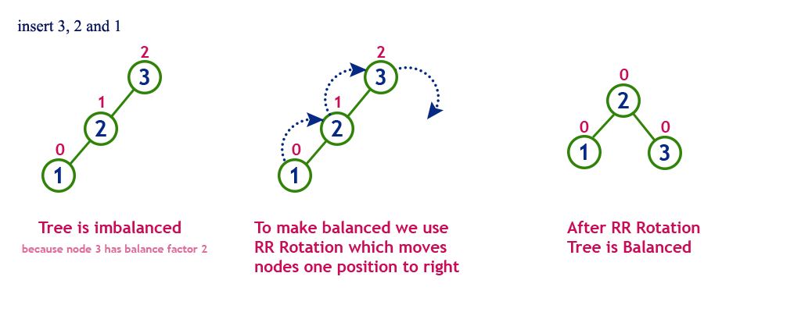

# Balanced Binary Search Tree - AVL Tree
AVL tree is a height-balanced binary search tree (BST). In an AVL tree, every node maintains a balance factor,
which is defind as follows

  ```shell script
balance_factor := height(left_subtree) - height(right_subtree)
```
According to definition of a balanced tree, the balance factor of every node in the AVL tree 
is either -1, 0, or 1. When an insertion or deletion operation is performed, the tree's height may change, so do the 
 balance factors at nodes. Whenever the balance factor of a node goes over the range, the tree will re-balance 
itself by operating rotation at that node. One can find more details 
[here](http://www.btechsmartclass.com/data_structures/avl-trees.html).

### Rotation 
Basically, there is 4 cases that the tree is imbalanced at a node, and correspondingly 4 rotation methods that will be 
performed to make the tree balanced. It is noted that the below images of illustration rotation operations
 and insertion example are borrowed from 
 [BTeach Smart Class](http://www.btechsmartclass.com/data_structures/avl-trees.html)
 
 0. The right subtree is too high, and the right child has a right child. In this case, Left Rotation operation is used
  to rotate the nodes one position to the left. 
 
 
 0. The left subtree is too high, and the left child has a left child. Right Rotation is used in this case to
 rotate nodes one position to the right.
  
  
 0. The right subtree is too high, and the right child has a left child. This case requires double rotation operations 
 called Right Left Rotation. At first, Right Rotation will be performed at the right node of given node, then a Left Rotation will
 be used at the given node.
  
  
 0. The left subtree is too high, and the left child has a right child. Right Left Rotation operation will be used in this case.
 


### Insertion Operation in AVL Tree
A new element is inserted to an AVL tree in the same logic as to a BST. However, balance factor of 
each node is updated and checked after insertion. The tree is said to be imbalanced if the balance factor of any node is 
other than 0, 1 or -1. In this case, suitable rotation operation is used to re-balance the tree. 

It can be shown that a height-balanced tree with n nodes has height O(log2(n)). 
Since the cost of our algorithms is proportional to the height of the tree, each operation 
(lookup, insertion or deletion) will take time O(log2(n)) in the worst case.

**Example - Construct an AVL tree by inserting numbers from 1 to 8** 


### Implementation
```go
package main

import "fmt"

type Node struct {
	Value int   // value of a node
	Left  *Node // left node
	Right *Node // right node
	Bal   int   // Bal = h_left - h_right
}

/*--------------------------------------------------------------------------------
		                   INSERTION
Insert a given data to an existing balanced subtree at node n,
re-balance the subtree by calling Rebalance function if needed
--------------------------------------------------------------------------------*/
func (n *Node) Insert(data int) {
	// Node already exists, do no change
	if data == n.Value {
		fmt.Println("Node already exists")
		return
	}
	// If data is less than value of Node c, traverse to the left. 
	// Otherwise, traverse to the right
	if data < n.Value {
		// Left node does not exist. Create a new one
		if n.Left == nil {
			n.Left = &Node{Value: data}
			// Update Balance Factor of Node n
			n.Bal++
			return
		}

		a := n.Left.Bal
		n.Left.Insert(data)
		// Check whether the tree's height has changed after inserting
		if n.Left.Bal != 0 && n.Left.Bal != a {
			if n.Left.Bal < -1 || n.Left.Bal > 1 {
				n.Rebalance(n.Left)
			} else {
				n.Bal++
			}
		}
		return
	}

	if n.Right == nil {
		n.Right = &Node{Value: data}
		n.Bal--
		return
	}

	b := n.Right.Bal
	n.Right.Insert(data)
	if n.Right.Bal != 0 && n.Right.Bal != b {
		if n.Right.Bal < -1 || n.Right.Bal > 1 {
			n.Rebalance(n.Right)
		} else {
			n.Bal--
		}
	}
	return
}

/*--------------------------------------------------------------------------------
		                   RE-BALANCING
Perform suitable rotation operation to make a subtree balanced.
c is considered node
n is parent node of node c
Helper functions: LLRotation, RRRotation, LRRotation, RLRotation
--------------------------------------------------------------------------------*/

func (n *Node) Rebalance(c *Node) {
	fmt.Printf("Re-Balance @ node %v \n", c.Value)

	// Left subtree is too high, and left child has a left child.
	if c.Bal == 2 && c.Left.Bal == 1 {
		n.RRRotation(c)
		return
	}

	// Right subtree is too high, and right child has a right child.
	if c.Bal == -2 && c.Right.Bal == -1 {
		n.LLRotation(c)
		return
	}

	// Left subtree is too high, and left child has a right child.
	if c.Bal == 2 && c.Left.Bal == -1 {
		n.LRRotation(c)
		return
	}

	// Right subtree is too high, and right child has a left child.
	if c.Bal == -2 && c.Right.Bal == 1 {
		n.RLRotation(c)
		return
	}
}

func (n *Node) LLRotation(c *Node) {
	r := c.Right     // create a temporary node r to hold node c.Right
	c.Right = r.Left //  make  left children of r become right children of c
	r.Left = c       // make c as r left child
	// Update balance factor of node c and r
	if c.Left != nil && c.Right == nil {
		c.Bal = 1
	} else {
		c.Bal = 0
	}
	r.Bal = 0
	// Let parent node n point to new node r
	if c == n.Left {
		n.Left = r
	} else {
		n.Right = r
	}
}

func (n *Node) RRRotation(c *Node) {
	l := c.Left      
	c.Left = l.Right 
	l.Right = c      

	if c.Right != nil && c.Left == nil {
		c.Bal = -1
	} else {
		c.Bal = 0
	}
	l.Bal = 0
	if c == n.Left {
		n.Left = l
	} else {
		n.Right = l
	}
}

func (n *Node) LRRotation(c *Node) {
	c.LLRotation(c.Left)
	n.RRRotation(c)
}

func (n *Node) RLRotation(c *Node) {
	c.RRRotation(c.Right)
	n.LLRotation(c)
}

/*--------------------------------------------------------------------------------
		                   TREE TYPE
A tree can either be empty or has a node. Each node in a tree has left and right subtrees.
If a tree is empty, inserting an element to the tree is creating a root node.
Performing insertion to a tree has to take care of re-balancing the root node if 
the tree is imbalanced at root node
--------------------------------------------------------------------------------*/

type AVLTree struct {
	Root *Node
}

// Insertion
func (t *AVLTree) Insert(data int) {
	if t.Root == nil {
		t.Root = &Node{Value: data}
		return
	}
	t.Root.Insert(data)
	// Check whether the root node gets out of balance
	if t.Root.Bal < -1 || t.Root.Bal > 1 {
		t.rebalance()
	}
}

/* The root node has no parent, to be unable to use node's Rebalance method above
a fake parent node is created. This node stores value -1, and root node is its either 
 left child or right child */

func (t *AVLTree) rebalance() {
	rootParent := &Node{Left: t.Root, Value: -1}
	rootParent.Rebalance(t.Root)
	t.Root = rootParent.Left
}

//Print the tree with displaying nodes' heights
func (t *AVLTree) print(n *Node, height int) {
	if n == nil {
		return
	}
	format := "--["
	t.print(n.Right, height+1)
	fmt.Printf("%*s%d(%v)\n", 7*(height+1), format, n.Value, n.Bal)
	t.print(n.Left, height+1)
}

func main() {
    values := []int{1, 2, 3, 4, 5, 6,  7, 8}
	// values := []int{11, 2, 13, 4, 3, 2, 5, 6, 1, 7, 8, 10, 9}
	t := &AVLTree{}
	for i := 0; i < len(values); i++ {
		fmt.Printf("Insert %v------------------------------------------\n", values[i])
		t.Insert(values[i])
		t.print(t.Root, 0)
		fmt.Println()
	}
}
```

### TODO Deletion Operation in AVL Tree
   The deletion operation in AVL Tree is similar to deletion operation in BST. 
   But after every deletion operation, we need to check with the Balance Factor condition. 
   If the tree is balanced after deletion go for next operation otherwise perform suitable 
   rotation to make the tree Balanced.

### References

* [Balanced BST from cs.ecu.edu](http://www.cs.ecu.edu/karl/3300/spr16/Notes/DataStructure/Tree/balance.html)
* [Trees from sc.ecu.edu](http://www.cs.ecu.edu/karl/3300/spr16/Notes/DataStructure/Tree/index.html)
* [AVL Tree from BTech Smart Class](http://www.btechsmartclass.com/data_structures/avl-trees.html)